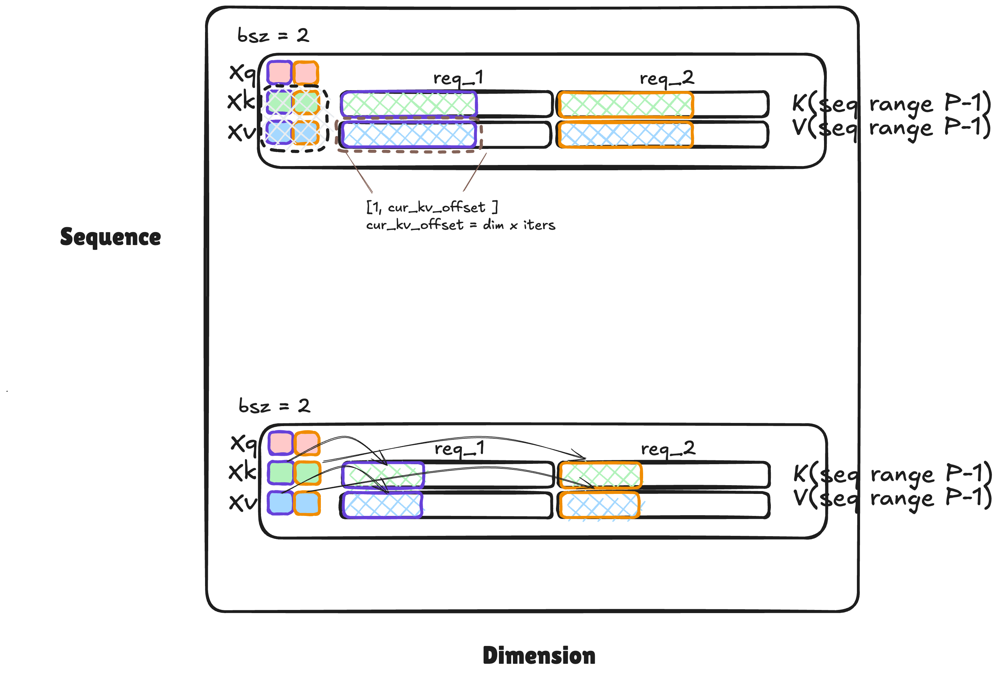
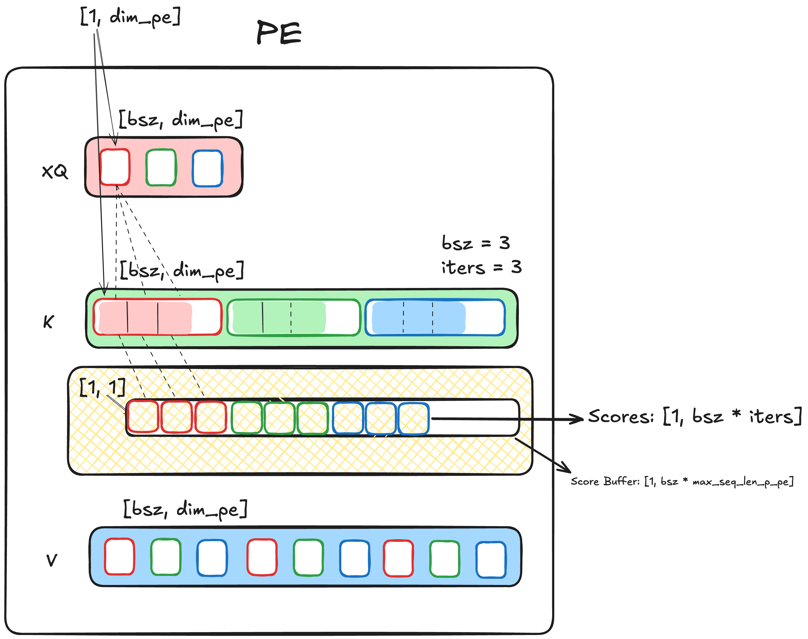
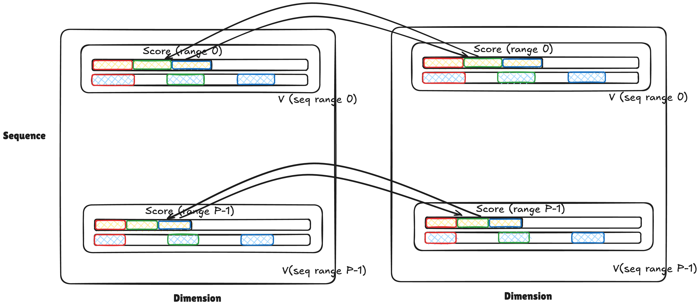
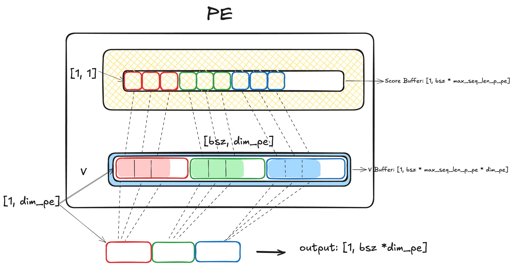

### KV Layout

### Scoring

Compute score locally at PE

All reduce row wise

### Output

Output based on score locally at PE

> Written with [StackEdit](https://stackedit.io/).
<!--stackedit_data:
eyJoaXN0b3J5IjpbLTk1NTUxMjEwOV19
-->

