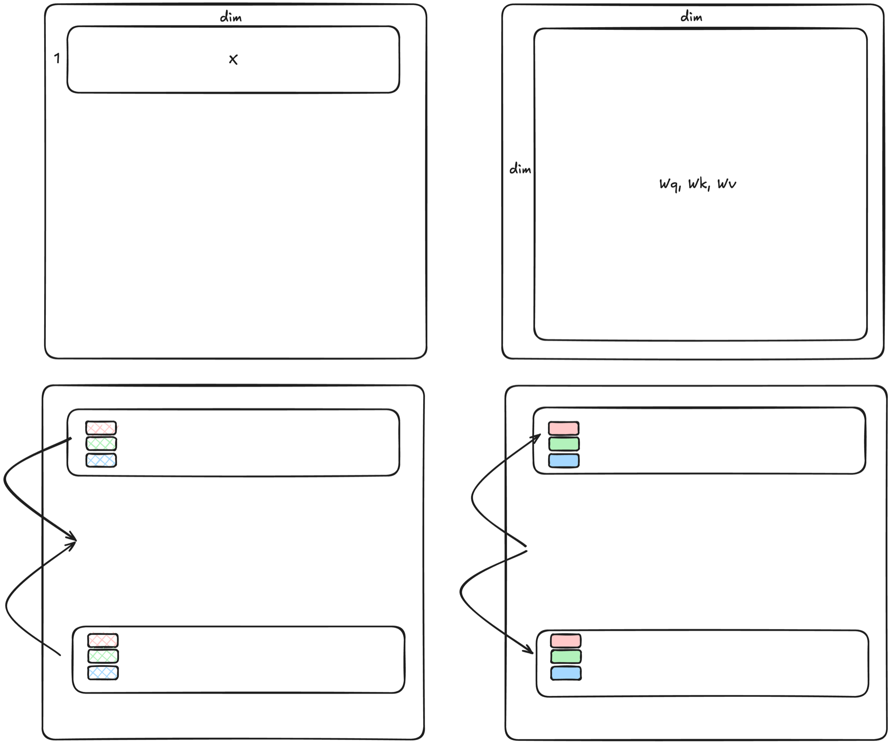
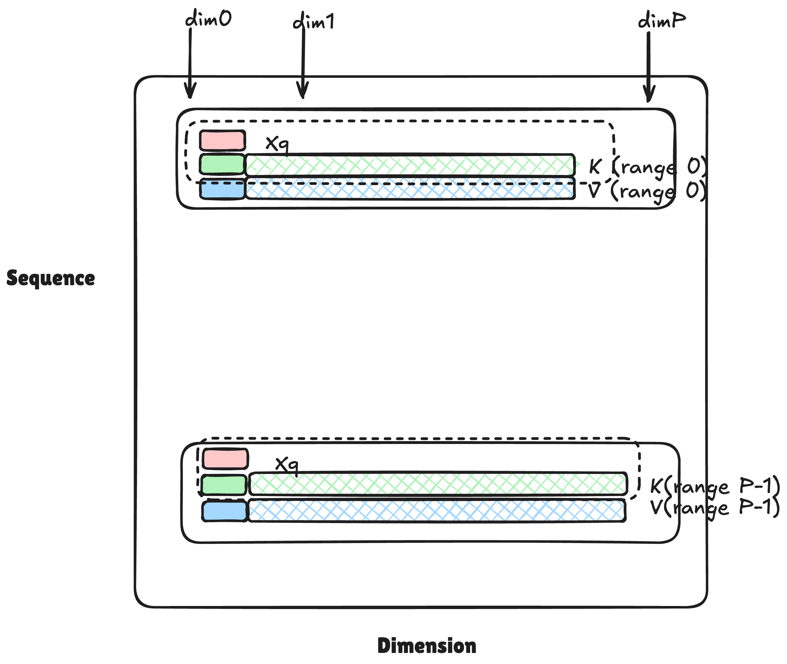
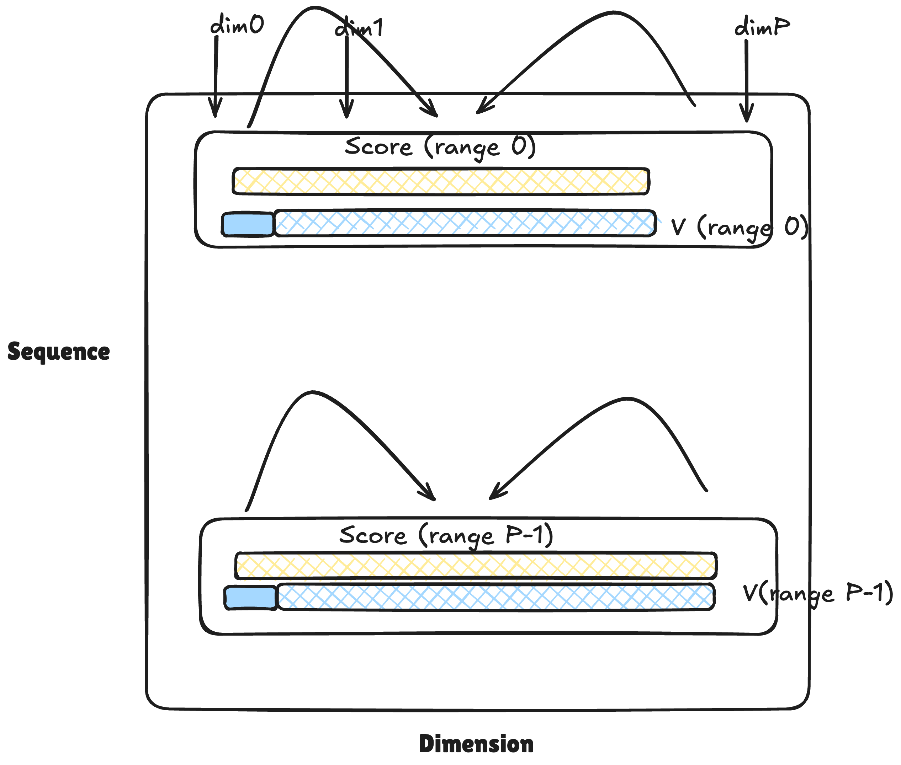
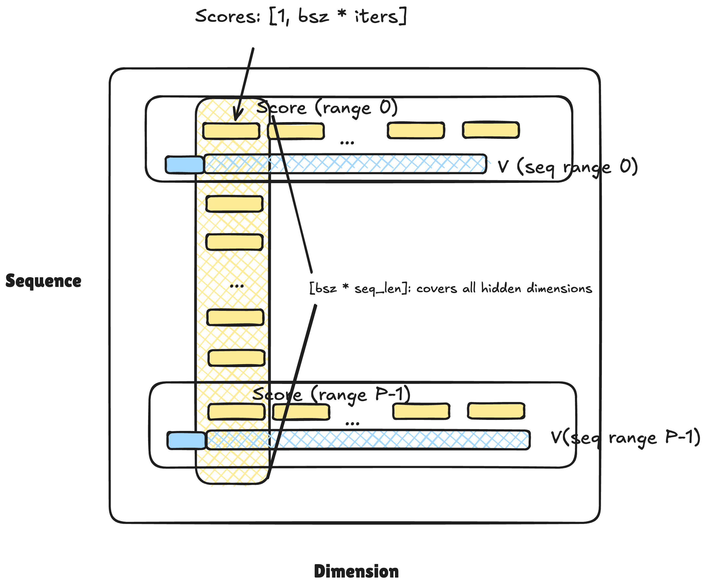
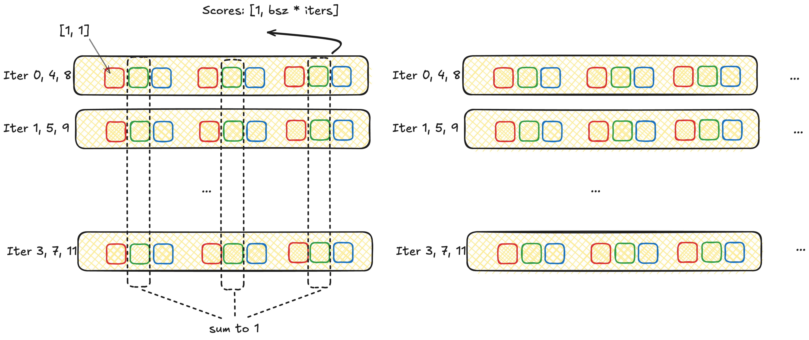
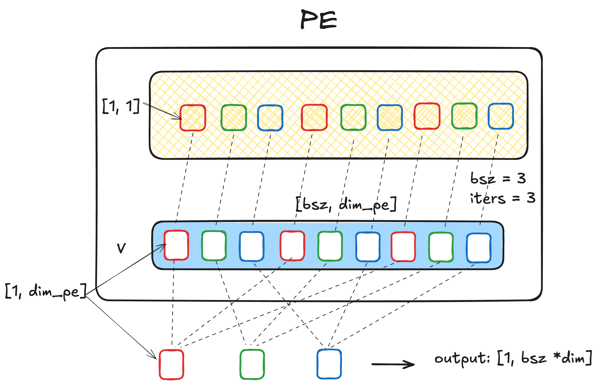
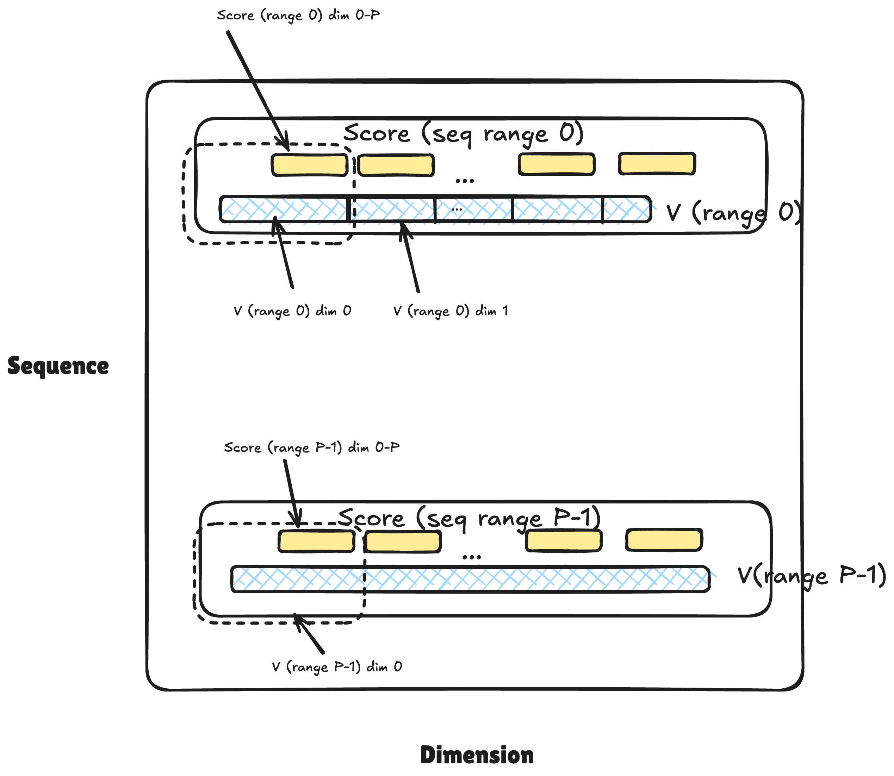
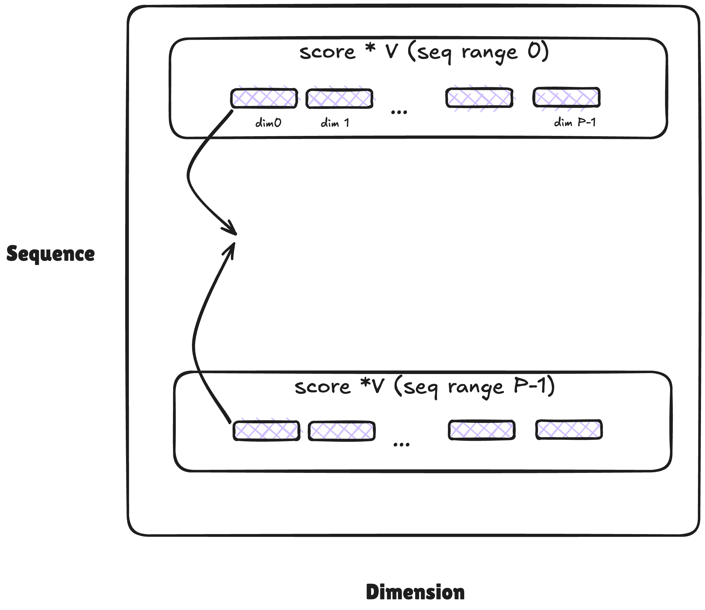
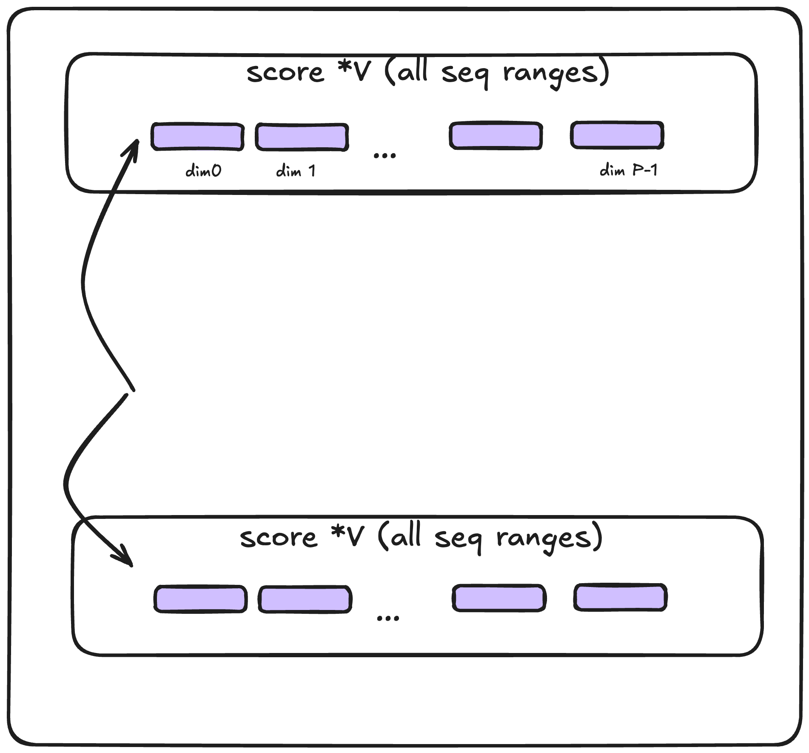

### QKV fusion 
- Merging local Xq, Xk, Xv
- allReduce + broadcast along y axis
- 3 * dim_p_pe * bsz

### Scoring 
-  score = Xq * K
- [1, dim_p_pe] * [dim_p_pe, seq_len_local]
- allReduce + broadcast along x axis 

Compute score locally at PE

<!-- <figure> -->

<!-- <figcaption>Your caption text here</figcaption>
</figure> -->

Scoring steps globally

<!-- <figure> -->

<!-- <figcaption>Your caption text here</figcaption>
</figure> -->

### Softmax
- AllReduce/broadcast along y axis
  

### Output
- output =  V * score
- [dim_p_pe, seq_len_local] * [1, dim_p_pe]
- AllReduce/broadcast along y axis

Compute PE -local output

Output step globally

Written with [StackEdit](https://stackedit.io/).
> 
<!--stackedit_data:
eyJoaXN0b3J5IjpbMTkyODM1NTA0NiwyMDU5MjU3OTYxLC0xMT
M0MTE3MjUzLDczMDk5ODExNl19
-->