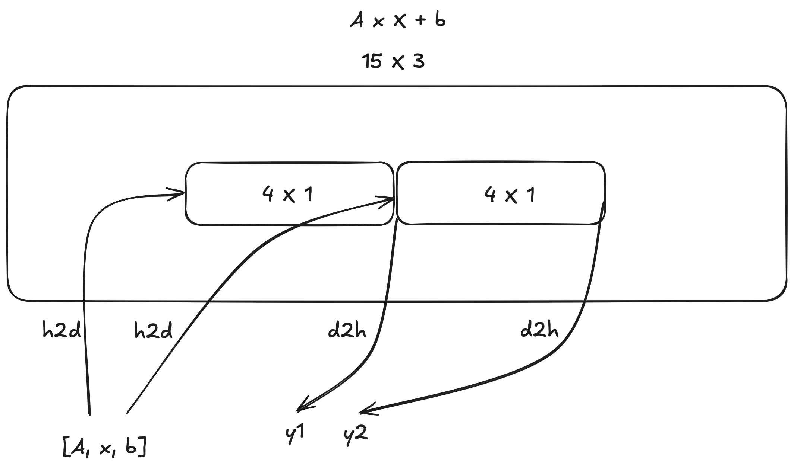

# GEMV Host-to-Device Multiple PEs Two Tenants Example

This example demonstrates a complete CSL (Cerebras Software Language) program that performs GEMV (General Matrix-Vector multiplication) computations on multiple processing elements (PEs) with two tenants, using host-to-device data transfer.

## Overview

This example extends the basic GEMV program to use multiple PEs organized into two tenants:
- **Tenant A**: Uses PEs (0, 0) through (width-1, 0), running `pe_program_r1.csl`
- **Tenant B**: Uses PEs (width, 0) through (width*2-1, 0), running `pe_program_r2.csl`

The number of PEs per tenant is controlled by the `width` compile-time parameter. Each PE computes `y = Ax + b`, where:
- `A` is an M×N matrix (stored in row-major format)
- `x` is an N×1 vector
- `b` is an M×1 vector
- `y` is the result vector (M×1)

**Key Features:**
- Host-to-device (H2D) data transfer using `memcpy_h2d`
- Multiple PEs per tenant for parallel computation
- Efficient memory access using DSDs (Data Structure Descriptors)
- Multiple computation iterations



## File Structure

```
gemv-h2d-multiple-pes-two-tenants/
├── layout_r.csl          # Layout file for two-tenant configuration
├── layout.csl             # Layout file for single-tenant configuration
├── pe_program_r1.csl      # PE program for Tenant A
├── pe_program_r2.csl      # PE program for Tenant B
├── pe_program.csl         # PE program for single-tenant layout
├── run.py                 # Host program handling H2D data transfer and computation
├── commands_wse2.sh       # WSE-2 compilation and run commands
├── commands_wse3.sh       # WSE-3 compilation and run commands
└── README.md              # This document
```

## Program Structure

### Layout File (`layout_r.csl`)

The layout file defines a two-tenant configuration:

- **PE Grid**: A `(width * 2) × 1` rectangular layout
  - Tenant A: PEs (0, 0) through (width-1, 0)
  - Tenant B: PEs (width, 0) through (width*2-1, 0)

- **Code Assignment**:
  - First `width` PEs execute `pe_program_r1.csl` (Tenant A)
  - Next `width` PEs execute `pe_program_r2.csl` (Tenant B)
  - Uses `@range(i16, width, width * 2, 1)` to iterate over Tenant B PEs

- **Exported Symbols**:
  - `A`, `x`, `b`: Input data (host-writable)
  - `y1`: Result vector for Tenant A (host-readable)
  - `y2`: Result vector for Tenant B (host-readable)
  - `compute`: Host-callable computation function

### PE Programs (`pe_program_r1.csl` and `pe_program_r2.csl`)

Both PE programs are identical except for the exported symbol name (`y1` vs `y2`). They use DSDs for efficient memory access:

1. **Memory Allocation**:
   - `A`: M×N matrix (row-major)
   - `x`: N-element vector
   - `b`: M-element vector
   - `y`: M-element result vector (initialized to zero)

2. **DSDs (Data Structure Descriptors)**:
   - `A_dsd`: Accesses columns of matrix A
   - `b_dsd`: Accesses vector b
   - `y_dsd`: Accesses result vector y

3. **Computation** (`gemv` function):
   - Uses `@fmacs` to compute `y = A*x` column by column
   - Uses `@fadds` to add vector `b` to the result
   - Efficiently updates DSD offsets during computation

4. **Main Function** (`compute` function):
   - Resets `y` to zero
   - Resets `A_dsd` to column 0
   - Calls `gemv()` to perform computation
   - Calls `sys_mod.unblock_cmd_stream()` to allow subsequent memcpy operations

### Host Program (`run.py`)

The host program demonstrates host-to-device data transfer and multiple computation iterations:

1. **Read Compile Parameters**:
   - Reads `M`, `N`, and `width` from `out.json` metadata

2. **Prepare Data**:
   - Creates matrix `A`, vectors `x` and `b`
   - Calculates expected result `y_expected = A@x + b`

3. **Initialize Runtime**:
   - Creates `SdkRuntime` instance
   - Loads and runs the program

4. **Multiple Iterations** (`for step in range(2)`):
   - **Copy Data to Tenant A**:
     - Copies `A`, `x`, `b` to PEs (0, 0) through (width-1, 0)
     - Uses `np.tile()` to replicate data for multiple PEs
   - **Copy Data to Tenant B**:
     - Copies `A`, `x`, `b` to PEs (width, 0) through (width*2-1, 0)
   - **Launch Computation**:
     - Calls `compute` function on all PEs
   - **Retrieve Results**:
     - Copies `y1` from Tenant A PEs
     - Copies `y2` from Tenant B PEs
   - **Verify Results**:
     - Asserts that results match expected values

5. **Cleanup**:
   - Stops the program

## Building and Running

### WSE-2 System

```bash
# Compile (example with width=2)
csbuild layout_r.csl -o out --params M=4,N=6,width=2

# Run (simulator)
python run.py --name out

# Run (actual hardware)
python run.py --name out --cmaddr <IP:port>
```

### WSE-3 System

```bash
# Compile (example with width=2)
csbuild layout_r.csl -o out --params M=4,N=6,width=2

# Run (simulator)
python run.py --name out

# Run (actual hardware)
python run.py --name out --cmaddr <IP:port>
```

Or use the provided scripts:

```bash
# WSE-2
bash commands_wse2.sh

# WSE-3
bash commands_wse3.sh
```

## Expected Output

The program executes two iterations and outputs:

```
SUCCESS!
SUCCESS!
```

Each iteration verifies that both tenants produce correct results matching the expected computation.

## Key Concepts

### Host-to-Device Data Transfer

Unlike examples that initialize data on the device, this example demonstrates:
- **`memcpy_h2d`**: Copies data from host to device before computation
- **Data Replication**: Uses `np.tile()` to copy the same data to multiple PEs
- **Rectangular Regions**: Specifies PE regions using (start_x, start_y, width, height)

### Multiple PEs Per Tenant

- Each tenant uses multiple PEs for parallel computation
- The `width` parameter controls the number of PEs per tenant
- All PEs in a tenant execute the same computation independently

### DSDs (Data Structure Descriptors)

DSDs provide efficient memory access patterns:
- **Column Access**: `A_dsd` accesses columns of matrix A
- **Offset Increment**: `@increment_dsd_offset` moves to the next column
- **Vector Operations**: `@fmacs` and `@fadds` use DSDs for efficient computation

### Multiple Iterations

The program demonstrates:
- Reusing the same device program for multiple computations
- Copying fresh data for each iteration
- Verifying results after each iteration

## Matrix Dimensions

- `M = 4`: Number of matrix rows, also the length of result vector `y`
- `N = 6`: Number of matrix columns, also the length of input vector `x`
- `width`: Number of PEs per tenant (compile-time parameter)

## Differences from Other Examples

### vs. `gemv-two-tenants`:
- Uses host-to-device data transfer instead of device-side initialization
- Supports multiple PEs per tenant (scalable with `width` parameter)
- Uses DSDs for efficient memory access
- Demonstrates multiple computation iterations

### vs. `gemv-05-multiple-pes`:
- Adds two-tenant architecture
- Uses different PE programs for each tenant
- Exports separate result symbols (`y1` and `y2`)

## Notes

- The `width` parameter must be set at compile time
- Both tenants receive the same input data in this example
- In real applications, different tenants may process different data
- The program demonstrates efficient use of DSDs for matrix operations
- Multiple iterations show how to reuse device programs for streaming workloads

